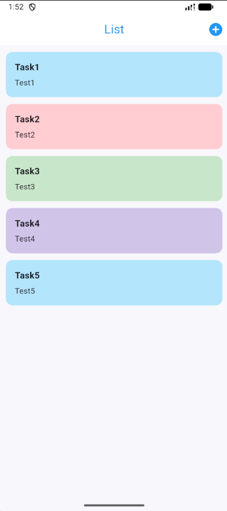
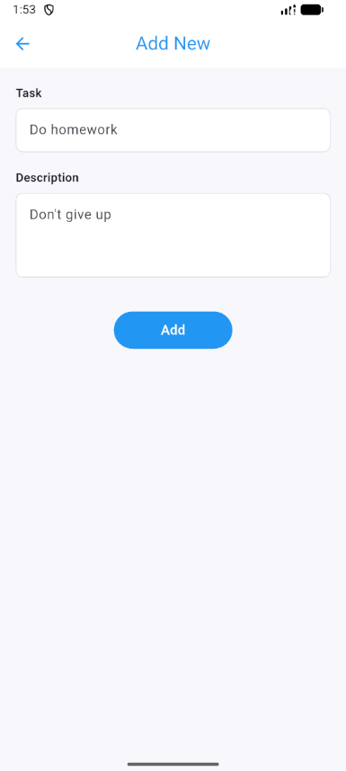

# Bài tập kết môn LTTBDD

---

## 📱 Chức năng chính
- Hiển thị danh sách công việc
- Thêm công việc mới
- Dữ liệu được lưu cục bộ và **vẫn hiển thị khi offline**
- Cập nhật danh sách ngay sau khi thêm mới

---

## 🏗️ Kiến trúc
Ứng dụng được xây dựng theo mô hình **MVVM (Model – View – ViewModel)**:

- **Model**: Định nghĩa cấu trúc dữ liệu `Task`
- **View**: Giao diện người dùng (List, Add New)
- **ViewModel**: Xử lý logic, quản lý trạng thái
- **Repository**: Trung gian truy xuất dữ liệu
- **Database**: SQLite (sqflite)

---

## 💾 Lưu trữ dữ liệu
- Sử dụng **SQLite (sqflite)** để lưu trữ dữ liệu cục bộ
- Database được lưu trong sandbox của ứng dụng (`tasks.db`)
- Đảm bảo ứng dụng hoạt động **offline**
- Giải pháp này **tương đương Room trong Android**

---

## 🧰 Công nghệ sử dụng
- Flutter
- Dart
- Provider (State Management)
- SQLite (sqflite)
- MVVM Architecture

---

## 🖼️ Giao diện ứng dụng

### 📋 Màn hình danh sách công việc


### ➕ Màn hình thêm công việc mới


---

## 🚀 Cách chạy project
```bash
flutter pub get
flutter run
